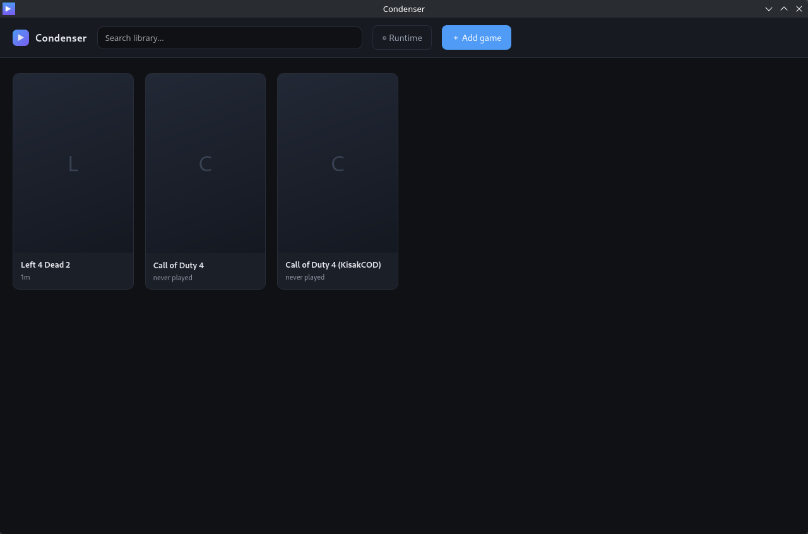
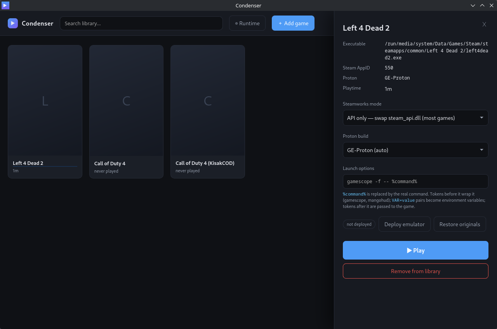
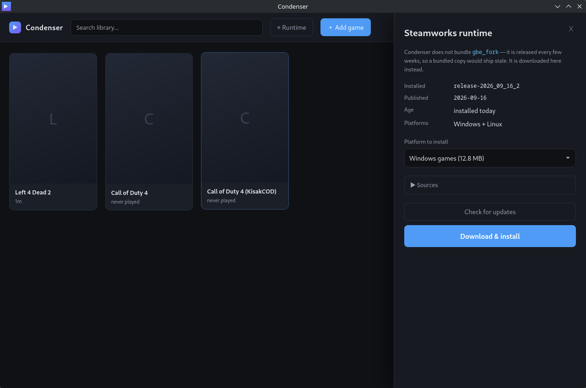
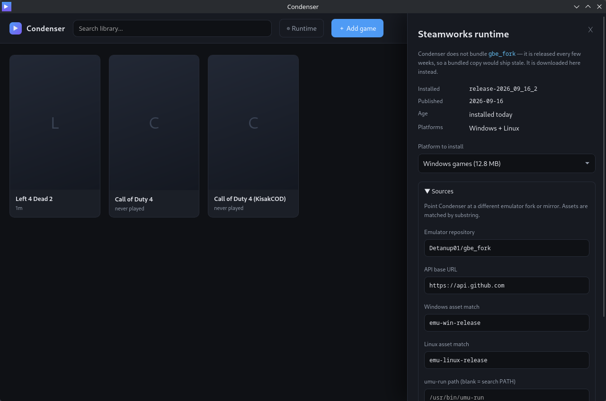

# Condenser

A Steam-like game launcher that runs your Steam games **without the Steam client**.

Condenser is glue between two excellent upstream projects:

| Layer | Project | Role |
| --- | --- | --- |
| Runtime | [umu-launcher](https://github.com/Open-Wine-Components/umu-launcher) | Proton + Steam Linux Runtime container, prefix management, protonfixes |
| Steamworks | [gbe_fork](https://github.com/Detanup01/gbe_fork) | Emulates the Steamworks API — achievements, stats, DLC, SteamID, LAN co-op |

Neither project alone gives you a *library*. Condenser adds the grid UI, per-game Proton
prefixes, Steam-style launch options, and a one-click emulator deployment pipeline on top.

<details>
<summary><b>Screenshots</b></summary>

| | |
| :---: | :---: |
|  |  |
| **Library** — recently played first, deployment state per game | **Game details** — Steamworks mode, Proton build, launch options |
|  |  |
| **Runtime** — installed emulator release, age, platforms, update check | **Sources** — point at a different fork, mirror or umu build |

</details>

---

## ⚠️ Scope and limitations — read this first

**Condenser does not, and will not, bypass Steam DRM.**

`gbe_fork` replaces the *Steamworks API* (`steam_api64.dll`), which is the layer games use
for achievements, stats and DLC checks. It does **not** touch SteamStub/CEG, the actual DRM
wrapper Valve applies to some executables. Concretely:

- ✅ **Works:** DRM-free games, and games that only use the Steamworks API for features.
- ❌ **Does not work:** games wrapped in SteamStub/CEG. Those need an unpacked executable,
  which Condenser does not provide and will not help you obtain.

The intended use case is **running games you own, offline or on a LAN, without the Steam
client** — handy for lightweight installs, LAN parties, offline machines, and keeping a
game playable independent of a background client.

---

## Architecture

```
frontend/              Vanilla JS + CSS grid UI (no bundler, no network)
src-tauri/             Tauri v2 shell + the CLI, sharing one engine
crates/condenser-core  Engine:
                         library      persisted game library
                         gbe          emulator deployment (symlink + lock)
                         umu          Proton launch orchestration
                         proton       discovery of installed Proton builds
                         runtime      fetch/extract/version the emulator
                         launch_options  Steam-compatible %command% parsing
assets/                README screenshots
```

The engine crate is **GUI-free on purpose** so it compiles and tests on an immutable host
without `webkit2gtk`:

```bash
cargo test -p condenser-core
```

## Build

The Tauri shell needs `webkit2gtk-4.1`, which isn't installable on an immutable host
(Bazzite/Silverblue). Build it inside a container:

```bash
distrobox enter build-box -- bash -c "cd $PWD && cargo tauri build"
```

System dependencies inside the container:

```bash
sudo apt-get install -y libwebkit2gtk-4.1-dev libgtk-3-dev libayatana-appindicator3-dev librsvg2-dev patchelf libxdo-dev
```

Build gotchas, host-specific quirks and debugging notes live in [AGENT.md](AGENT.md).

## Third-party components are fetched, never bundled

Condenser ships **neither** umu nor gbe_fork. Both are downloaded at runtime and cached
under `~/.local/share/condenser/`. Two reasons:

- **Staleness.** gbe_fork releases every 2–4 weeks. Anything bundled is out of date
  within the month.
- **Size.** The release binary is ~20 MB. The gbe_fork libraries alone are ~61 MB
  extracted, and umu's Proton + Steam Linux Runtime payload is ~2.2 GB — which umu
  downloads itself regardless, so bundling the 410 KB `umu-run` zipapp buys nothing.

| Component | Handled by Condenser? | Cache location |
| --- | --- | --- |
| gbe_fork libraries | ✅ download, version-track, update | `~/.local/share/condenser/gbe_fork` |
| gbe_fork release manifest | ✅ written on install | `…/gbe_fork/condenser-manifest.json` |
| umu-run | ❌ **must be installed by you** | — |
| Proton + Steam Linux Runtime | ⬜ umu fetches these itself | `~/.local/share/umu` |

## Setup

1. Install `umu-launcher` so `umu-run` is on `PATH`. Condenser does not install it.
2. Fetch the Steamworks emulator from the **⚙ Runtime** panel in the app, or from
   the command line:
   ```bash
   condenser runtime install --platform both
   ```
3. Launch Condenser, click **Add game**, point it at a game executable, and optionally
   supply the Steam AppID (this enables achievement/DLC config and protonfixes).

### Managing the runtime

The **⚙ Runtime** panel shows the installed release tag, its age, which platforms are
covered, and checks upstream for newer releases — so a machine set up months ago doesn't
silently run an ancient emulator. Releases can be pinned by tag.


Set `GITHUB_TOKEN` to avoid the 60 req/h unauthenticated GitHub API limit.

## How a launch works

```
GAMEID=<appid> STORE=none WINEPREFIX=<per-game> \
  PROTONPATH=/…/compatibilitytools.d/Proton-GE\ Latest \
  umu-run /path/to/game.exe
```

`PROTONPATH` is always resolved to an absolute path first. Passing a bare name like
`GE-Proton` makes umu try to *download* that build, which fails on an offline or
rate-limited machine even when suitable builds are installed.

Before the first launch, Condenser deploys the emulator into the game directory:

1. Finds every `steam_api.dll` / `steam_api64.dll` / `libsteam_api.so`.
2. **Moves** each one aside as `*.condenser-orig` — a rename, so nothing is duplicated
   and the original bytes are preserved exactly (an existing backup is never overwritten).
3. **Symlinks** the gbe_fork library into place.
4. Writes `steam_settings/` beside it (AppID, account name).

### Disk usage

Deployment uses symlinks rather than copies, so the emulator libraries exist exactly once
on disk no matter how many games you add. `steam_api64.dll` alone is 11.4 MB — a
ten-game library would otherwise waste over 100 MB duplicating it.

If the game lives on a filesystem that cannot host symlinks (NTFS, exFAT), Condenser falls
back to a real copy automatically. A useful side effect of linking: updating the runtime
propagates to every linked game without re-deploying.

While a deployment is live, both the shared library and the `*.condenser-orig` backup are
set read-only. A Steam update or file validation that writes to the game's `steam_api`
path would otherwise follow the symlink and overwrite the shared library for *every*
game — read-only makes that write fail instead. **Restore originals** returns the file to
the game writable.

Removing a game from the library reverts it automatically.

## Command line

The same binary is the CLI: bare `condenser` opens the window, any argument runs
headless. Everything the UI does is reachable this way, so the launcher is scriptable
without a display.

```bash
condenser list                                  # library, with deployment state
condenser add /path/to/game.exe --title "X" --appid 550
condenser play "Left 4"                         # matches id prefix or part of the title
condenser preview "Left 4"                      # print the launch command, run nothing
condenser set-options "Left 4" gamescope -f -- %command%
condenser set-proton "Left 4" "Proton-GE Latest"
condenser set-mode "Left 4" api                 # api | cold | none
condenser deploy "Left 4" / revert "Left 4" / revert-all
condenser runtime status | check | install --platform both | releases
condenser proton list
condenser sources show | set --repo owner/fork | reset
condenser --help
```

`--json` is accepted by `list`, `show`, `runtime status`, `runtime check`, `proton list`
and `sources show`. Game selectors match an id prefix or a unique, case-insensitive part
of the title; an ambiguous match is reported rather than guessed.

`set-options` is not flag-parsed, so launch options can be written with or without
quotes — `--`, `-flags` and `%command%` all survive intact.

## Launch options

Each game has a **Launch options** field with the same semantics as the Steam client's,
so strings can be pasted straight across:

```text
gamescope --hdr-enabled -W 3440 -H 1440 -r 180 -f -- %command%
WINEDLLOVERRIDES="mss32=n,b" %command% -novid
-windowed -w 1920
```

* `%command%` expands to the command Condenser would otherwise run (`umu-run <exe>`).
* Tokens **before** it wrap that command — the first is the program to exec.
* `VAR=value` pairs at the front become environment variables.
* Tokens **after** it are passed to the game.
* With no `%command%`, the whole string is treated as game arguments, as Steam does.

## Proton

Condenser discovers Proton builds already installed on the machine — every
`compatibilitytools.d` and every Steam library — and each game can pick one. The default
`GE-Proton` resolves to a locally installed GE build if there is one, and is only handed
to umu for download when nothing local matches.

## Changing where the emulator comes from

**⚙ Runtime → Sources** repoints Condenser at a different `gbe_fork` fork, a private
mirror, or a GitHub Enterprise host:

| Setting | Default |
| --- | --- |
| Emulator repository | `Detanup01/gbe_fork` |
| API base URL | `https://api.github.com` |
| Windows asset match | `emu-win-release` |
| Linux asset match | `emu-linux-release` |
| `umu-run` path | *(blank — search `PATH`)* |

Assets are matched by substring, so a fork that keeps upstream naming needs only the
repository changed.

## Emulator settings

gbe_fork is configured through INI files in its `steam_settings/` folder, where the
section prefix selects the file — `[user::general]` lives in `configs.user.ini`,
`[app::dlcs]` in `configs.app.ini`, and so on.

Condenser exposes this as **two layers**, in the UI (*Emulator settings*, in the game
drawer and the Runtime panel) and on the CLI:

```bash
condenser config show                                   # global layer
condenser config show --game "Left 4"                   # effective, with the source of each value
condenser config set user::general::account_name Ada    # global
condenser config set --game "Left 4" main::connectivity::offline 1
condenser config unset --game "Left 4" main::connectivity::offline
condenser config keys                                   # common keys, with descriptions
```

**Per-game entries override global ones.** The merged result is written into the game's
`steam_settings/` on the next deploy, so changes need a re-deploy (or just press Play) to
take effect.

Any `<user|main|app|overlay>::<section>::<key>` is accepted, not just the common ones —
see [gbe_fork's `steam_settings.EXAMPLE`](https://github.com/Detanup01/gbe_fork/tree/main/post_build/steam_settings.EXAMPLE)
for the full reference.

> **Why not upstream's global folder?** gbe_fork also reads a global `GSE Saves/settings/`
> directory, but for Windows games that path resolves *inside the Wine prefix* — and since
> every game gets its own prefix, it would not be global at all. Condenser keeps the global
> layer itself and merges it in at deploy time, which upstream documents as always winning.
> The precedence you observe is the same, and it behaves identically for native Linux games.

## Steamworks modes

| Mode | When to use |
| --- | --- |
| **API only** | Default. Game links `steam_api64.dll` — a plain swap works. |
| **Cold client** | Game expects a running Steam client; uses gbe_fork's ColdClientLoader. |
| **None** | DRM-free game with no Steamworks — launch straight through Proton. |

## Status

**1.0.0.** Verified end to end: Left 4 Dead 2 launched to its main menu through Proton
with the Steam client fully shut down, then reverted with every file byte-identical to
the original.

Working: library, per-game Proton prefixes, emulator fetch/version/update, symlink
deployment with read-only protection, Steam-style launch options, Proton discovery,
and full CLI parity with the UI.

Not yet implemented:

- **SteamGridDB artwork** — the model and cache directory exist; nothing fetches yet.
- **`generate_emu_config`** — achievements and DLC lists are not generated, so
  `steam_settings/` carries only the AppID and account name.
- **ColdClientLoader** — the *Cold client* mode is selectable but still deploys as
  API-only.

### Known issues

- **AppImage on Fedora-family hosts** aborts with `EGL_BAD_PARAMETER`
  ([tauri#15976](https://github.com/tauri-apps/tauri/issues/15976)): the bundler
  over-bundles `libwayland-client` ahead of the host copy. Workaround:
  ```bash
  LD_PRELOAD=/usr/lib64/libwayland-client.so.0 ./Condenser_1.0.0_amd64.AppImage
  ```
  The plain binary from the tarball is unaffected.
- **CLI mode still links webkit**, since it is the same binary as the GUI, so
  `libwebkit2gtk-4.1` must be present even for `condenser list`.

## License

[Unlicense](LICENSE) — public domain.

`umu-launcher` (GPL-3.0) and `gbe_fork` (LGPL-3.0) are separate projects under their own
licenses and are **not redistributed here**; Condenser fetches or invokes them at runtime.
